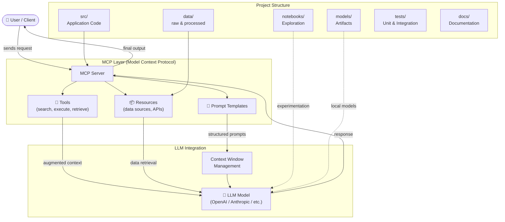

# demo-mcp-genai

> this is for demo

Demo Gen AI project showcasing MCP and LLM integration patterns.

## Architecture



## Project Structure

```
demo-mcp-genai/
├── src/            # Application source code
├── data/
│   ├── raw/        # Original, immutable data
│   └── processed/  # Cleaned and transformed data
├── notebooks/      # Jupyter notebooks for exploration
├── models/         # Trained / exported model artifacts
├── tests/          # Unit and integration tests
└── docs/           # Project documentation
```

## Getting Started

```bash
pip install -r requirements.txt
```
